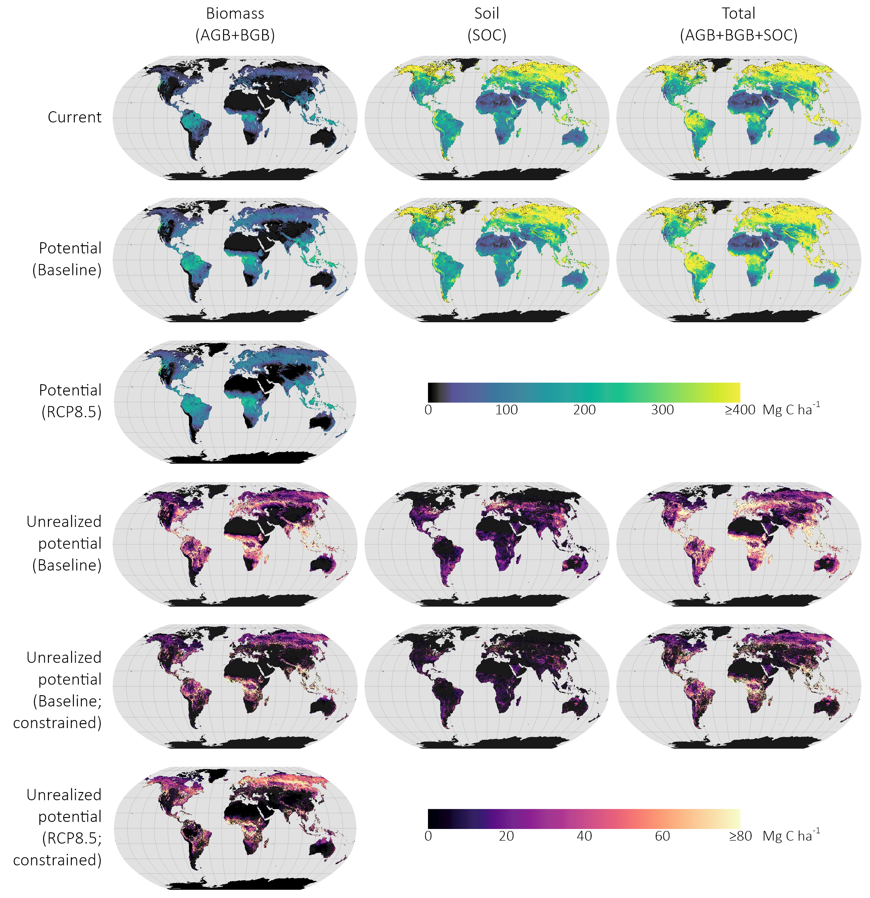

# Global-Potential-Carbon

This repository contains code central to the analysis reported by Walker et al. (2022) on the global potential for increased storage of carbon on land. Output spatial data are available for download from the Harvard Dataverse at [https://doi.org/10.7910/DVN/DSDDQK](https://doi.org/10.7910/DVN/DSDDQK).

	

##### Contents

* [1_mapping](./1_mapping) contains code used to model/map current, potential, and unrealized potential carbon stored in aboveground, belowground, and soil organic matter at the 500m spatial resolution.
* [2_analysis](./2_analysis) contains code used to summarize global carbon stocks using raster-based zonal statistics.
* [classes](./classes) contains CSVs used to identify classes in zonal rasters.

##### License

This work is licensed under a [Creative Commons Attribution-NonCommercial-NoDerivatives 4.0 International License (CC BY-NC-ND)](http://creativecommons.org/licenses/by-nc-nd/4.0/). You may not use this work for commercial purposes; if you transform or build upon this work, you may not distribute the modified version. You must cite the paper when using any of this repository's contents for any purpose:

* Walker, W.S., S.R. Gorelik, S.C. Cook-Patton, A. Baccini, M.K. Farina, K.K. Solvik, P.W. Ellis, J. Sanderman, R.A. Houghton, S.M. Leavitt, C.R. Schwalm, and B.W. Griscom. 2022. **The global potential for increased storage of carbon on land.** *Proceedings of the National Academy of Sciences.* [doi:10.1073/pnas.2111312119](https://doi.org/10.1073/pnas.2111312119).
